# FoodAura Flutter

تطبيق موبايل لطلب الطعام مبني بـ Flutter ومتصل بـ Supabase.

## المتطلبات
- Flutter SDK 3.x أو أحدث
- Dart 3.x

## التشغيل
```bash
flutter pub get
flutter run
```

## بيانات Supabase
- URL: https://ptpnkdaigzhtnuackhtt.supabase.co
- المعرّف موجود في: lib/services/supabase_service.dart

## بيانات الدخول (Admin)
- الإيميل: admin@foodaura.com
- كلمة المرور: admin

## الميزات
- صفحة الرئيسية: شبكة منتجات مع فلترة وبحث
- المفضلة: حفظ واسترداد من SharedPreferences
- السلة: إضافة/حذف/تعديل الكميات
- ملف المستخدم: عرض البيانات وتسجيل الخروج
- المصادقة: إيميل + كلمة مرور، وضع ضيف
##  لقطات الشاشة

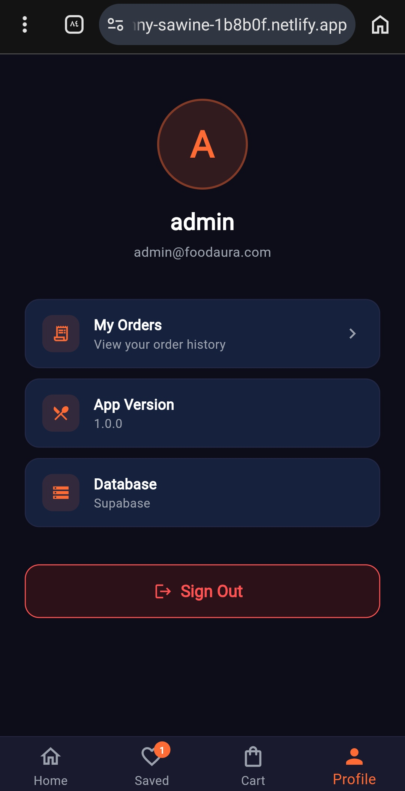
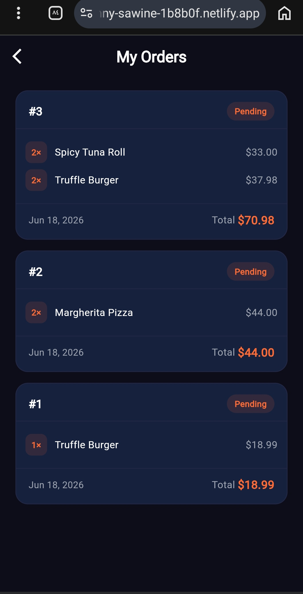
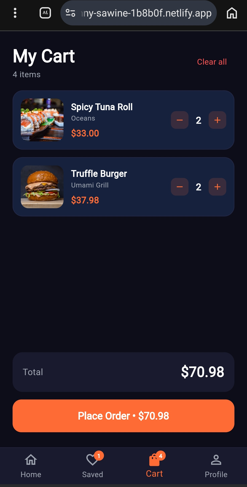
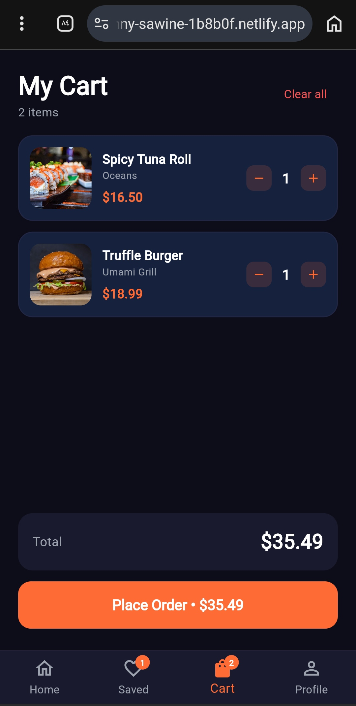
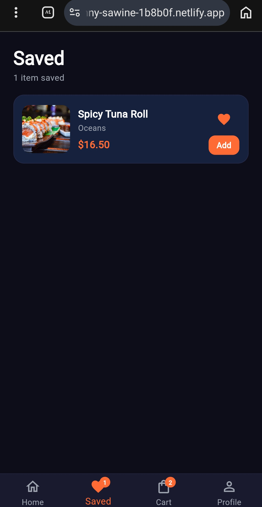
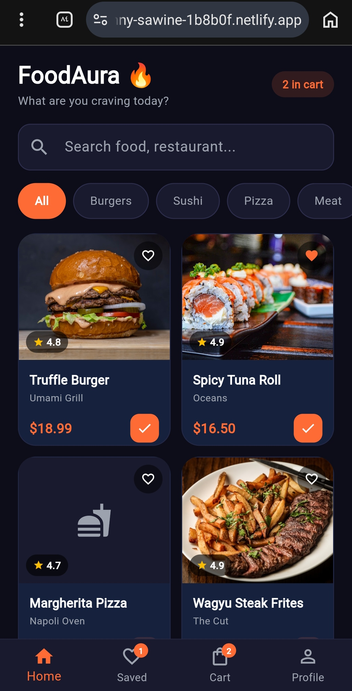
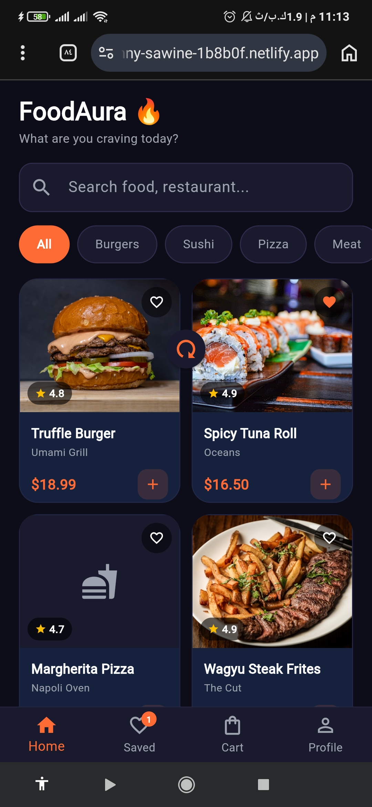
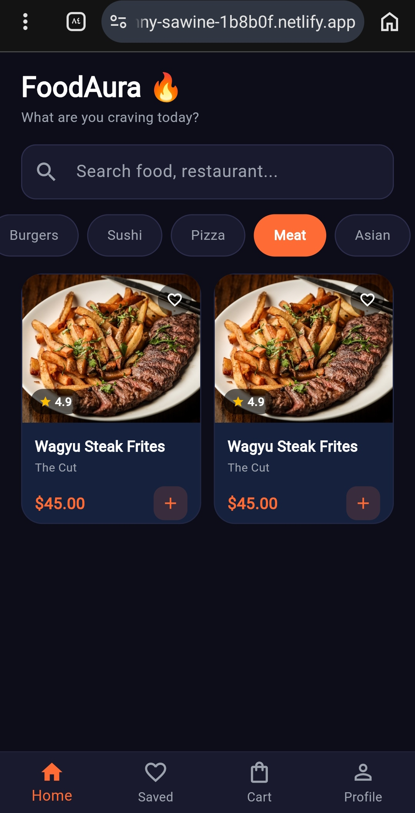
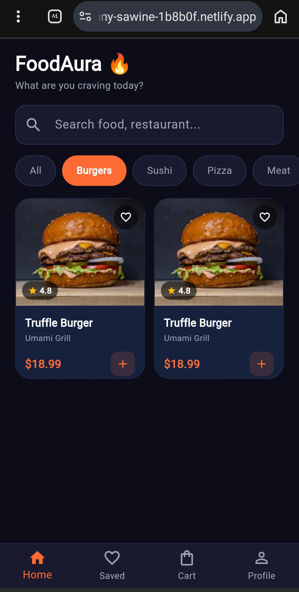
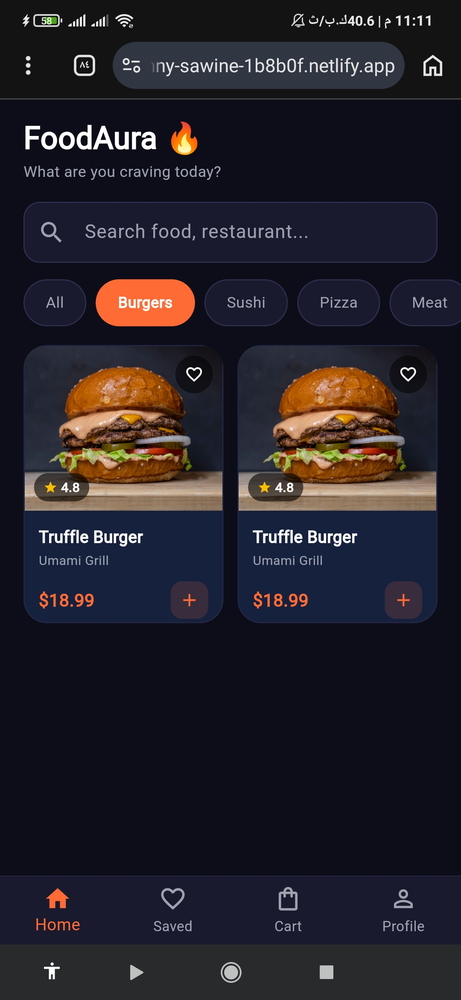
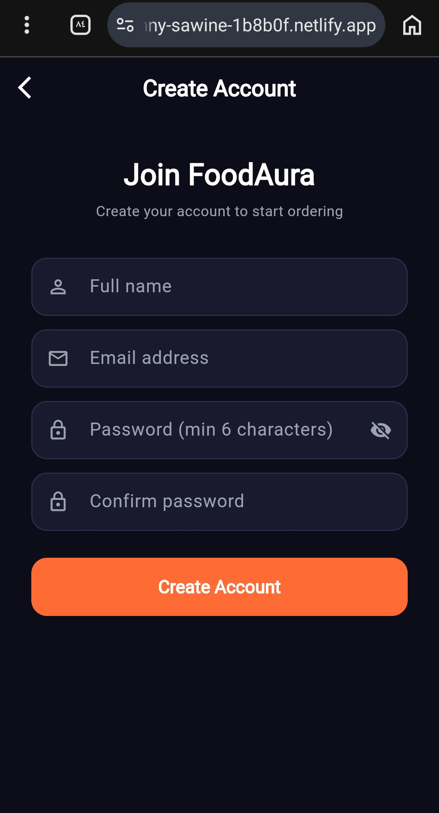
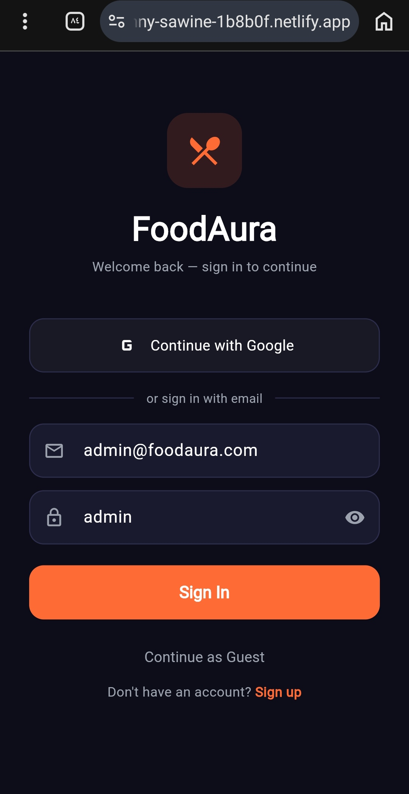